# SafeHer – Women's Safety and Emergency Assistance System

[](https://opensource.org/licenses/MIT)
[](https://developer.mozilla.org/en-US/docs/Web/HTML)
[](https://developer.mozilla.org/en-US/docs/Web/CSS)
[](https://developer.mozilla.org/en-US/docs/Web/JavaScript)
[-8b5cf6)](#-project-overview)

---

## 📖 Project Overview

**SafeHer** is a specialized web-based safety application designed to empower women with instant emergency tools, personal safety resources, live location sharing options, and emergency contact workflows. Built as an **academic mini-project / prototype**, SafeHer focuses on delivering a zero-friction, accessible, and responsive user experience designed to work when every second counts.

The platform unifies critical safety capabilities—such as a single-tap SOS workflow, trusted contact management, real-time GPS location access, national helpline numbers, incident logging with optional anonymity, and proactive safety awareness guidelines—into a clean, mobile-first web interface.

> [!NOTE]
> **Academic Context & Milestones:** SafeHer has successfully completed **Step 1 (Semantic HTML5 Architecture & Core Pages)** and **Step 2 (Complete UI Design System, 3D Web Creative Depth, and 60fps Motion Graphics Engine)**. The application uses modern CSS Custom Properties (Purple/Violet brand identity, meaningful SOS red), interactive 3D perspective tilt cards with specular glare, an interactive HTML5 particle canvas, and a multi-step 3D progress stepper. It is primed for **Step 3 (JavaScript Architecture & LocalStorage Foundation)**.

---

## 🎯 Problem Statement

Women's safety in urban and rural environments remains a critical societal challenge. During high-risk situations, emergency response is frequently hampered by key technical and practical obstacles:

1. **Delayed Communication:** Unlocking a smartphone, opening messaging apps, and manually typing coordinates to multiple family members requires too many steps under stress.
2. **Fragmented Helplines:** Emergency numbers (Police, Ambulance, Women's Helplines, Cyber Crime) are scattered across different platforms and hard to recall during emergencies.
3. **Lack of Incident Record Keeping:** Many victims of harassment or stalking lack a structured, private tool to document incidents with date, location, description, and optional anonymity for legal or personal records.
4. **Complex or Non-Accessible Interfaces:** Existing safety applications are often bloated, demand heavy background permissions, or fail on low-end devices and slow network connections.

---

## 💡 Proposed Solution

SafeHer addresses these challenges by offering a **centralized, lightweight web dashboard** that consolidates essential emergency workflows and safety resources into a unified interface:

* **One-Tap Emergency SOS:** Immediate visual trigger and emergency state handler to initiate contact notifications and capture coordinates.
* **Emergency Contacts Directory:** Dedicated interface to manage up to 5 trusted family members or friends.
* **Live Geolocation Access:** Browser-based GPS coordinate retrieval and shareable link generator.
* **Verified Emergency Helplines:** Quick reference to national emergency numbers (112, 100, 108, 1091, 1930).
* **Incident Logging:** Structured form supporting anonymous reporting, file attachments, and incident categorization.
* **Safety Awareness & Education:** Practical guidance covering personal, travel, public transport, and cyber safety.

---

## 🎯 Objectives

* **Speed & Accessibility:** Provide an intuitive interface requiring minimal clicks to activate emergency alerts.
* **Mobile-First Responsive Design:** Ensure seamless functionality across smartphones, tablets, and desktop displays.
* **Privacy-Centric Model:** Guarantee that location data and personal details are accessed exclusively upon explicit user request.
* **Zero External Dependencies:** Built with Vanilla HTML5, CSS3, and JavaScript to maximize performance, reliability, and ease of deployment.
* **Modular Foundation:** Structure the frontend architecture to seamlessly integrate with a future Flask/SQLite backend.

---

## ✨ Key Features

| Feature | Description | Primary Interface |
| :--- | :--- | :--- |
| 🆘 **One-Tap SOS** | Instant emergency alert workflow with countdown and cancel controls. | [`sos.html`](file:///p:/Women%20seffty/safeher/sos.html) |
| 🎙️ **Voice Activation Readiness** | Interface stub for hands-free voice command emergency triggering. | [`dashboard.html`](file:///p:/Women%20seffty/safeher/dashboard.html) |
| 👥 **Emergency Contacts** | Add and view up to 5 trusted emergency contacts. | [`contacts.html`](file:///p:/Women%20seffty/safeher/contacts.html) |
| 📍 **Live Location Sharing** | Retrieve current GPS coordinates using the HTML5 Geolocation API. | [`location.html`](file:///p:/Women%20seffty/safeher/location.html) |
| 📞 **Emergency Helplines** | Direct reference directory for police, ambulance, women's support, and cyber crime. | [`helplines.html`](file:///p:/Women%20seffty/safeher/helplines.html) |
| 📝 **Incident Reporting** | Document incidents with date, time, location, description, and evidence upload. | [`report.html`](file:///p:/Women%20seffty/safeher/report.html) |
| 👤 **Personal Safety Profile** | Manage user information, primary contacts, and safety settings. | [`profile.html`](file:///p:/Women%20seffty/safeher/profile.html) |
| 💡 **Safety Awareness Tips** | Curated safety strategies for travel, transport, cyber safety, and emergency prep. | [`safety-tips.html`](file:///p:/Women%20seffty/safeher/safety-tips.html) |
| 📬 **Contact & Feedback** | Project feedback and academic inquiry form. | [`contact.html`](file:///p:/Women%20seffty/safeher/contact.html) |
| 📱 **Responsive Navigation** | Mobile toggle drawer, breadcrumbs, and WCAG-compliant skip navigation. | All Pages |

---

## 📸 Application Screenshots

### 1. Home / Landing Page
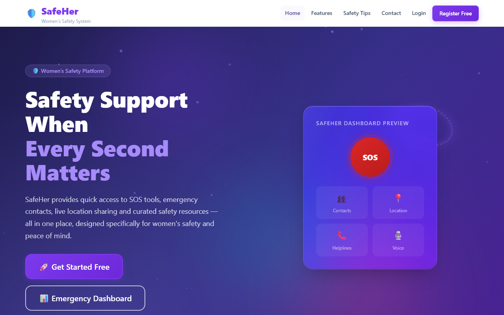
**Figure 1:** SafeHer Home Page – Introduction, Hero Banner, and Primary Calls-to-Action.

---

### 2. Core Safety Features
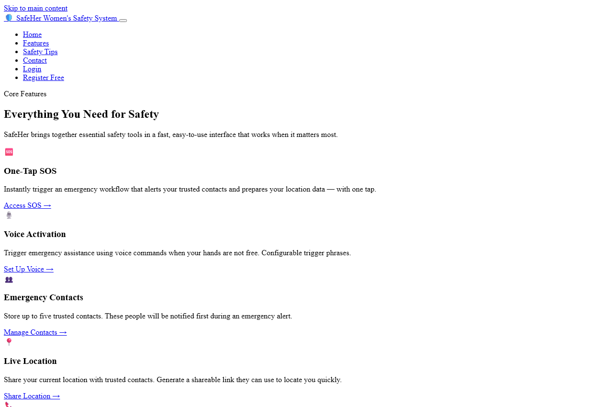
**Figure 2:** SafeHer Core Safety Features Grid displaying SOS, Voice Activation, Contacts, Location, Helplines, and Incident Reporting.

---

### 3. User Registration
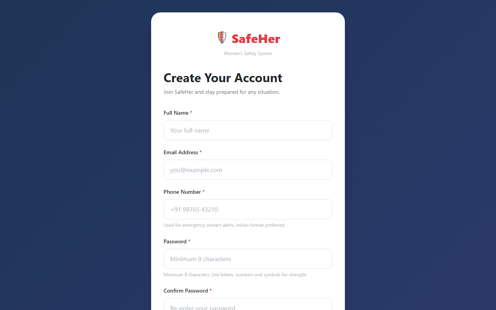
**Figure 3:** User Registration Interface with input validation fields and prototype disclaimers.

---

### 4. User Login
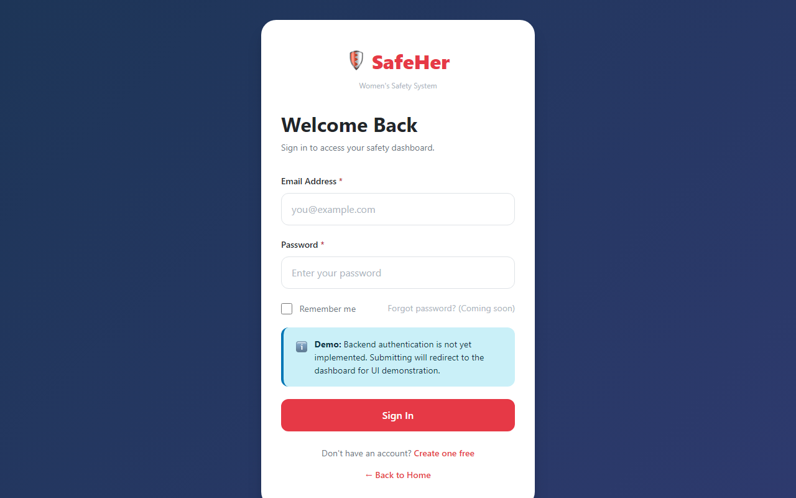
**Figure 4:** User Authentication Interface demonstrating responsive form controls and accessible labels.

---

### 5. Emergency Dashboard
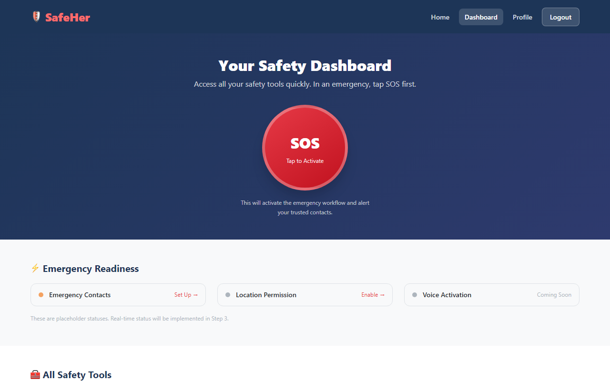
**Figure 5:** SafeHer Emergency Dashboard featuring prominent SOS activation button, readiness indicators, and quick-tool navigation.

---

### 6. One-Tap SOS Interface
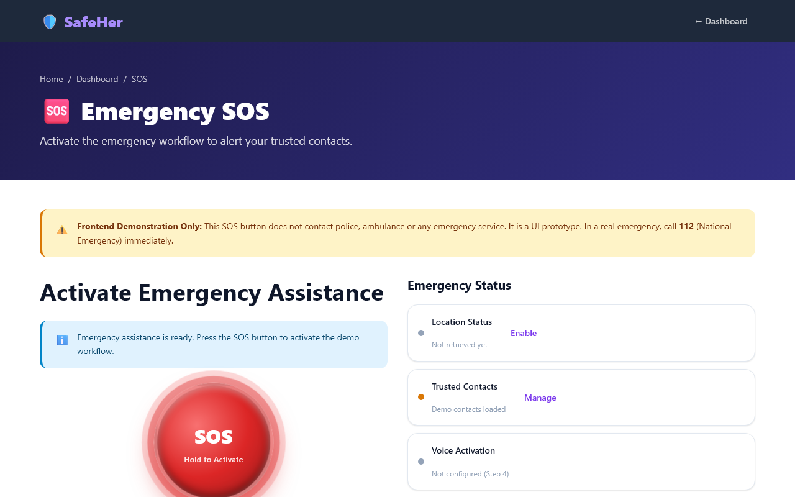
**Figure 6:** Dedicated One-Tap SOS Emergency Interface with status updates, cancellation option, and emergency numbers.

---

### 7. Emergency Contacts Management
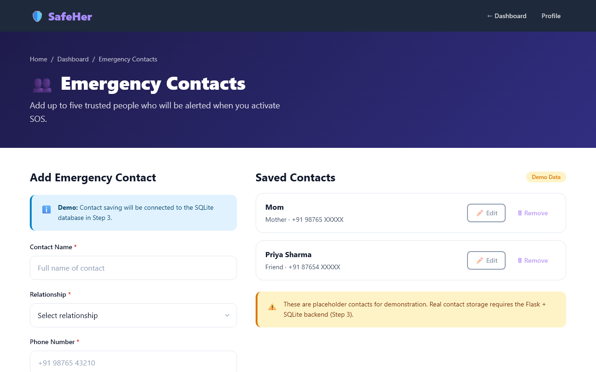
**Figure 7:** Emergency Contacts Management page showing contact addition form and demo contact cards.

---

### 8. Live Location Sharing Interface
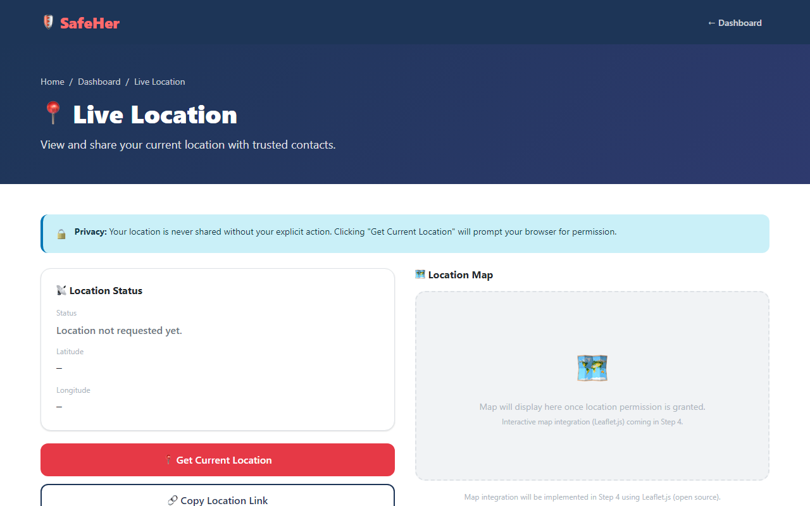
**Figure 8:** Live Location Sharing interface utilizing HTML5 Geolocation API with map preview area and sharing controls.

---

### 9. Emergency Helplines Directory
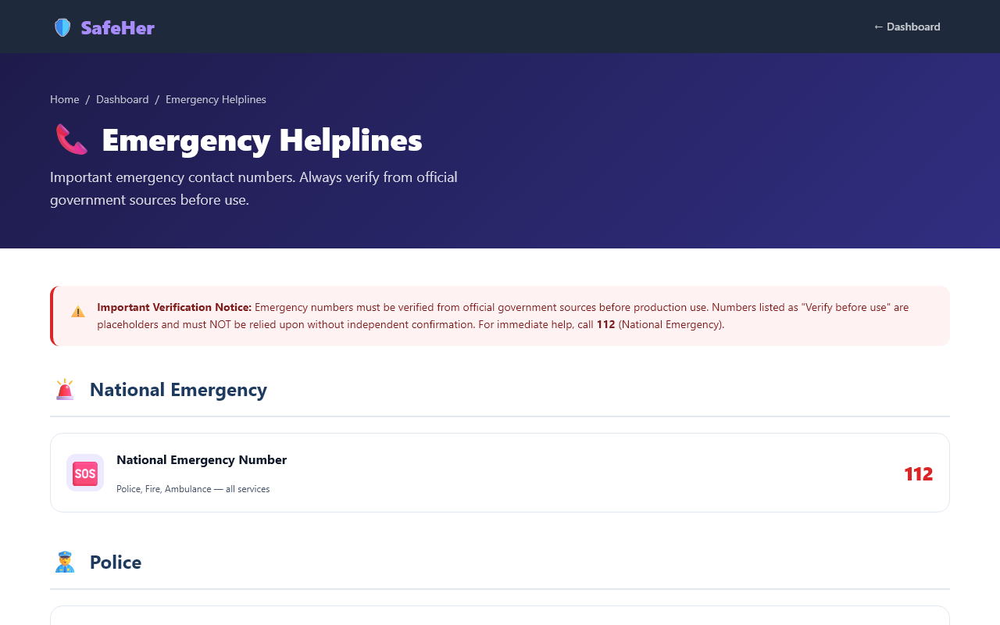
**Figure 9:** Emergency Helpline directory detailing National Emergency (112), Police (100), Ambulance (108), Women's Helpline (1091), and Cyber Crime (1930).

---

### 10. Incident Reporting Interface
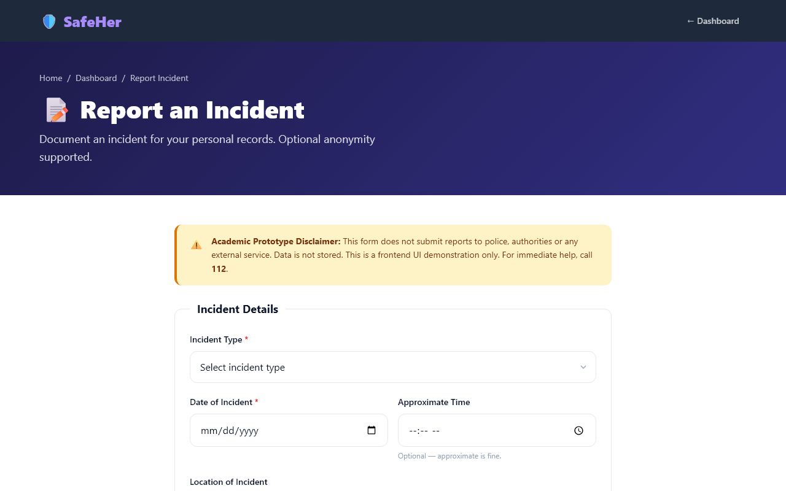
**Figure 10:** Structured Incident Reporting form with date/time pickers, incident categorization, evidence attachment UI, and anonymous submission toggle.

---

### 11. Voice Activation Feature
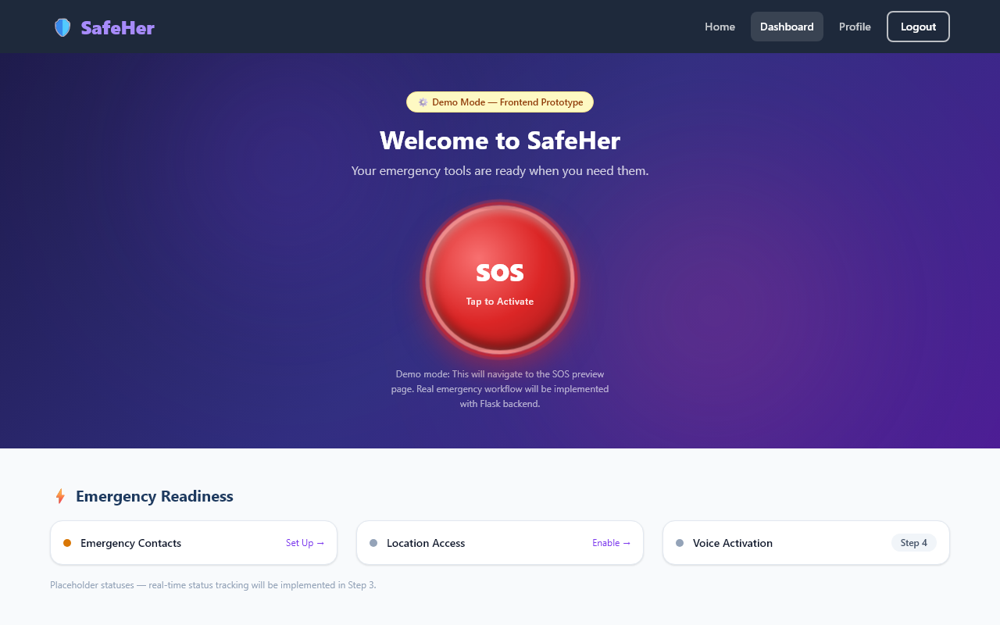
**Figure 11:** Voice Activation readiness section on the dashboard illustrating hands-free trigger preparation.

---

### 12. Personal Safety Profile
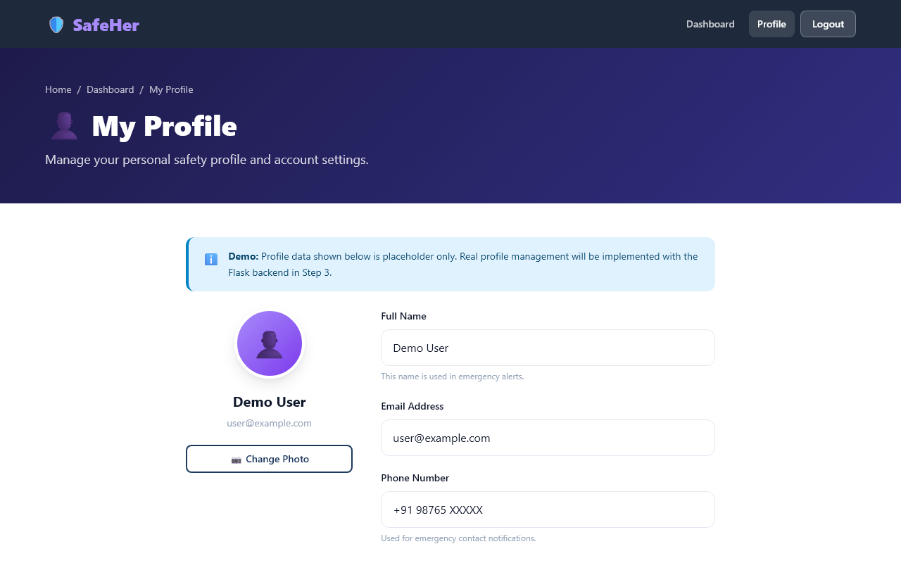
**Figure 12:** Personal Safety Profile page displaying user avatar, primary contact assignment, and account settings.

---

### 13. Safety Awareness & Prevention Tips
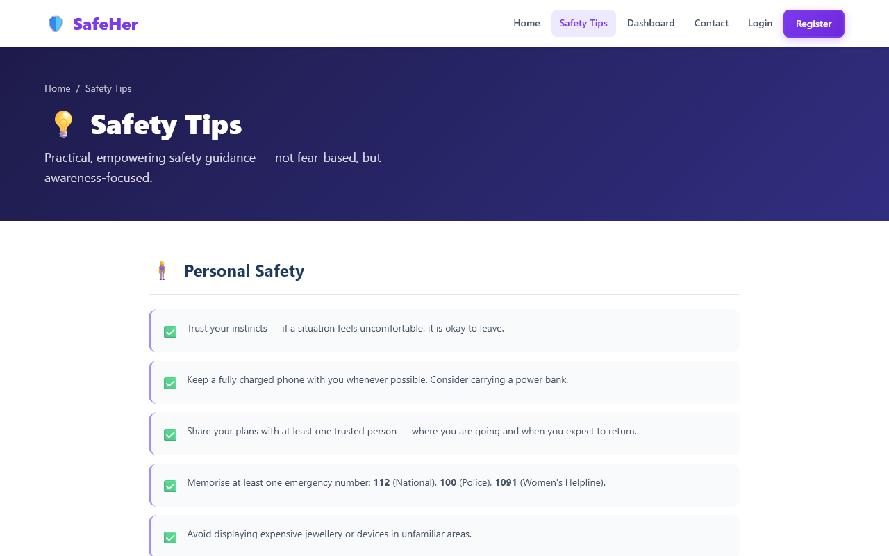
**Figure 13:** Categorized Safety Tips page providing practical guidance for travel, public transport, online safety, and self-defense.

---

### 14. Project Contact & Feedback Page
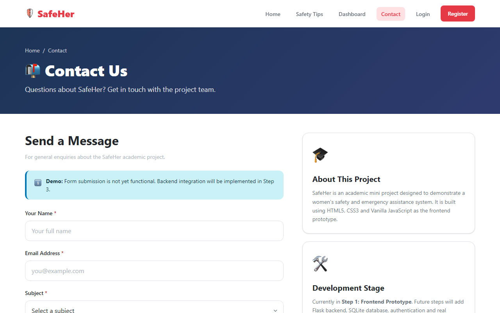
**Figure 14:** Project Contact and Feedback page with subject selector and academic project details.

---

### 15. Responsive Mobile Interface
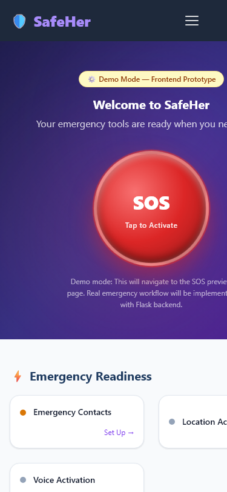
**Figure 15:** SafeHer Mobile View (375px viewport) highlighting mobile navigation drawer, fluid touch buttons, and responsive grid reflow.

---

## 🔄 Application Workflow

The application workflow is structured to minimize friction during emergencies while allowing comprehensive navigation during routine use:

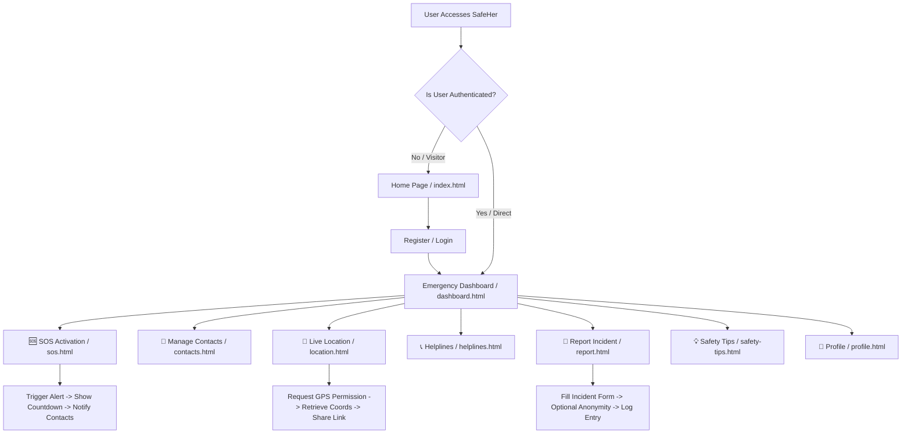

---

## 🏗️ System Architecture

SafeHer separates its **current prototype implementation** from its **planned full-stack production architecture**.

### 1. Current Architecture (Step 1 — Frontend Prototype)

```
[ User Browser ]
       │
       ├──► HTML5 Semantic Markup (Pages)
       ├──► CSS3 Custom Properties & 3D Motion System (style.css / responsive.css / animations.css)
       └──► Vanilla JavaScript Engines (ES6+)
              ├── animations.js (3D Particle Canvas, Specular Glare Tilt, Magnetic Physics)
              ├── main.js       (Global Navigation, Utilities & Toast Notifications)
              ├── auth.js       (Form Handlers & Auth Stubs)
              ├── sos.js        (SOS Workflow & Event Handlers)
              ├── location.js   (HTML5 Geolocation API Integration)
              ├── contacts.js   (Contact Card Rendering & Handlers)
              ├── report.js     (Incident Form Submission Handler)
              ├── validation.js (Central Validation Helper & Input Shake Controller)
              └── voice.js      (Web Speech API Feature Detection)
```

### 2. Planned Architecture (Step 3 & 4 — Full-Stack Production)

```
[ User Web Client ]
       │
       ▼ (HTTP / HTTPS REST Requests)
[ Python Flask Application Backend ]
       │
       ├──► Session & Auth Controller (Flask-Login, Password Hashing)
       ├──► Emergency Service Router (SOS Alert Queue)
       ├──► Third-Party Communication Gateway (Twilio SMS / WhatsApp API)
       └──► Leaflet.js / OpenStreetMap Service (Live Location Rendering)
       │
       ▼ (SQL Queries)
[ SQLite 3 Database ]
       ├── User Table (id, name, email, password_hash, phone)
       ├── Contacts Table (id, user_id, contact_name, relationship, phone)
       ├── Incidents Table (id, user_id, type, date, time, location, description, anonymous, file_path)
       └── Audit Logs Table (id, event_type, timestamp, status)
```

---

## 🛠️ Technology Stack

### Current Implementation (Step 2 Completed — Design System & 3D Motion)

* **Markup Language:** [HTML5](https://developer.mozilla.org/en-US/docs/Web/HTML) (Semantic elements: `<main>`, `<header>`, `<nav>`, `<section>`, `<article>`, `<fieldset>`, `<aside>`)
* **3D Canvas Rendering:** HTML5 Canvas 2D Context engine rendering interactive 3D particle constellations with mouse parallax depth.
* **Styling & Design System:** [CSS3](https://developer.mozilla.org/en-US/docs/Web/CSS) (CSS Custom Properties, Glassmorphism 2.0 `backdrop-filter: blur(24px)`, Flexbox, CSS Grid, Mobile-First Breakpoints).
* **60fps GPU Motion Engine:** Hardware-accelerated transitions utilizing composite properties (`transform: perspective() rotateX() rotateY() translate3d()`, `opacity`, and `will-change`).
* **Scripting Language:** [Vanilla JavaScript (ES6+)](https://developer.mozilla.org/en-US/docs/Web/JavaScript) (Strict mode `'use strict'`, DOM Manipulation, Event Handling, Window Location API, IntersectionObserver).
* **Browser Web APIs & Engines:**
  * `navigator.geolocation` (HTML5 Geolocation API for GPS coordinate retrieval)
  * `SpeechRecognition` / `webkitSpeechRecognition` (Web Speech API feature detection)
  * `IntersectionObserver` (Scroll-triggered spring staggered reveals)
  * `window.requestAnimationFrame` (Smooth 60fps 3D card tilt & particle updates)
  * `window.localStorage` (Prepared storage fallback for Step 3)
* **UI Micro-Systems:**
  * Global Accessible Toast Notifications (`window.showToast`)
  * Programmatic Input Error Shake (`window.triggerInputShake`)
  * Multi-Step 3D Stepper Progress Controller (`window.setStepperStep`)
* **Icons & Assets:** Native Unicode Emojis & Custom SVG Graphic Indicators

### Planned / Future Version (Full-Stack Roadmap)

* **Backend Framework:** Python 3.11+ with [Flask](https://flask.palletsprojects.com/)
* **Database Management System:** [SQLite 3](https://www.sqlite.org/) with [SQLAlchemy ORM](https://www.sqlalchemy.org/)
* **Authentication Security:** Werkzeug Security (`generate_password_hash`, `check_password_hash`), Flask-Login
* **Mapping API:** [Leaflet.js](https://leafletjs.com/) with OpenStreetMap tiles
* **External Alert Services:** Twilio REST API for automated emergency SMS & WhatsApp broadcasting

---

## 📂 Project Structure

```
p:\Women seffty\safeher\
├── assets/
│   ├── icons/                  # SVG icons and favicon resources
│   └── images/                 # Project images and graphics
│       └── README.md           # Assets directory guide
├── css/
│   ├── style.css               # Core CSS design tokens, purple brand system & components (51 KB)
│   ├── responsive.css          # Mobile-first responsive media queries & breakpoints (11.5 KB)
│   └── animations.css          # 3D motion engine, glassmorphism 2.0, stepper & ripple effects (10.3 KB)
├── docs/
│   └── screenshots/            # Documentation screenshots (15 high-res PNG files)
│       ├── 01-home.png
│       ├── 02-home-features.png
│       ├── 03-register.png
│       ├── 04-login.png
│       ├── 05-dashboard.png
│       ├── 06-sos.png
│       ├── 07-emergency-contacts.png
│       ├── 08-live-location.png
│       ├── 09-helplines.png
│       ├── 10-incident-report.png
│       ├── 11-voice-activation.png
│       ├── 12-profile.png
│       ├── 13-safety-tips.png
│       ├── 14-contact.png
│       └── 15-responsive-mobile.png
├── js/
│   ├── animations.js           # 60fps 3D particle canvas, specular glare tilt & magnetic buttons (6.3 KB)
│   ├── auth.js                 # Authentication logic, submit stubs & session checks
│   ├── contacts.js             # Emergency contacts renderer & form handling
│   ├── location.js             # HTML5 Geolocation API caller & status handler
│   ├── main.js                 # Mobile nav toggle, active links, smooth scroll & toast system (8.2 KB)
│   ├── report.js               # Incident report submit handler & status manager
│   ├── sos.js                  # One-Tap SOS emergency workflow handler
│   ├── validation.js           # Central validation utility library (email, phone, password & shake)
│   └── voice.js                # Web Speech API detection & voice command stubs
├── .gitignore                  # Git tracking rules
├── contact.html                # Contact and project inquiry page
├── contacts.html               # Emergency contacts management page
├── dashboard.html              # Main emergency safety dashboard
├── helplines.html              # Emergency helpline numbers directory
├── index.html                  # Main project landing page with 3D canvas & stepper
├── location.html               # Live location sharing page
├── login.html                  # User login page with floating labels
├── profile.html                # Personal safety profile management page
├── register.html               # User registration page
├── report.html                 # Incident report submission page
├── safety-tips.html            # Categorized safety tips & guidelines page
├── sos.html                    # Dedicated One-Tap SOS activation page with holographic ripple
└── README.md                   # Comprehensive project documentation
```

---

## 📄 Page Documentation

| File Name | Page Title | Primary Purpose | Key Components & Scripts |
| :--- | :--- | :--- | :--- |
| [`index.html`](file:///p:/Women%20seffty/safeher/index.html) | SafeHer – Home | Project landing page introducing core safety features and registration options. | Hero section, feature cards grid, 3-step workflow, safety awareness cards, main footer. Scripts: `js/main.js`. |
| [`dashboard.html`](file:///p:/Women%20seffty/safeher/dashboard.html) | Dashboard – SafeHer | Central user hub for rapid access to all safety tools during normal use or emergencies. | Primary SOS button, Emergency Readiness indicators, 8-tool grid, prototype banner. Scripts: `js/main.js`. |
| [`sos.html`](file:///p:/Women%20seffty/safeher/sos.html) | SOS Emergency – SafeHer | Dedicated, low-distraction emergency activation interface. | Prominent SOS button, status alert area, cancel control, who-will-be-alerted summary. Scripts: `js/main.js`, `js/sos.js`. |
| [`contacts.html`](file:///p:/Women%20seffty/safeher/contacts.html) | Emergency Contacts – SafeHer | Manage up to 5 trusted emergency contacts. | Add contact form (name, relationship, phone), demo contact list container. Scripts: `js/main.js`, `js/contacts.js`. |
| [`location.html`](file:///p:/Women%20seffty/safeher/location.html) | Live Location – SafeHer | View and share current GPS location with trusted contacts. | Location status panel, Lat/Lng display, "Get Location" button, map placeholder. Scripts: `js/main.js`, `js/location.js`. |
| [`helplines.html`](file:///p:/Women%20seffty/safeher/helplines.html) | Emergency Helplines – SafeHer | Directory of national emergency, police, medical, women's, and cyber helplines. | Category cards for 112, 100, 108, 1091, 1930, official verification notices. Scripts: `js/main.js`. |
| [`report.html`](file:///p:/Women%20seffty/safeher/report.html) | Report Incident – SafeHer | Document personal safety incidents securely. | Incident type dropdown, date/time pickers, location text, description, file upload, anonymous checkbox. Scripts: `js/main.js`, `js/report.js`. |
| [`register.html`](file:///p:/Women%20seffty/safeher/register.html) | Register – SafeHer | User sign-up interface for new accounts. | Full name, email, phone, password, confirm password, terms agreement, auth alert. Scripts: `js/main.js`, `js/auth.js`, `js/validation.js`. |
| [`login.html`](file:///p:/Women%20seffty/safeher/login.html) | Login – SafeHer | User authentication interface. | Email input, password input, remember me checkbox, demo redirect alert. Scripts: `js/main.js`, `js/auth.js`, `js/validation.js`. |
| [`profile.html`](file:///p:/Women%20seffty/safeher/profile.html) | My Profile – SafeHer | Manage account preferences and primary emergency contact. | Avatar placeholder, profile details form, primary contact field, account settings stubs. Scripts: `js/main.js`. |
| [`safety-tips.html`](file:///p:/Women%20seffty/safeher/safety-tips.html) | Safety Tips – SafeHer | Practical awareness guidance across multiple everyday domains. | Category lists for Personal, Travel, Transport, Online, Preparedness, Cyber Safety. Scripts: `js/main.js`. |
| [`contact.html`](file:///p:/Women%20seffty/safeher/contact.html) | Contact Us – SafeHer | Project feedback and academic contact page. | Inquiry form (name, email, subject, message), project stage sidebar, disclaimers. Scripts: `js/main.js`. |

---

## ⚙️ Feature Implementation Status

The following audit matrix clarifies the exact current implementation state of every feature in the repository:

| Feature | Current Status | Code Evidence | Technical Limitation / Scope |
| :--- | :--- | :--- | :--- |
| **One-Tap SOS Button** | `FRONTEND/DEMO` | Handled in [`sos.js`](file:///p:/Women%20seffty/safeher/js/sos.js#L34-L56) (`activateDemoSOS`) | Visual countdown and UI state update only. Does not contact police or dispatch real SMS. |
| **Emergency Contacts** | `FRONTEND/DEMO` | Handled in [`contacts.js`](file:///p:/Women%20seffty/safeher/js/contacts.js#L28-L54) (`renderDemoContacts`) | Renders static demo cards. Form submission triggers an alert without SQLite persistence. |
| **Live Geolocation** | `PARTIALLY IMPLEMENTED` | Handled in [`location.js`](file:///p:/Women%20seffty/safeher/js/location.js#L32-L75) (`getCurrentLocation`) | Successfully queries `navigator.geolocation` for real GPS coords. Does not embed interactive map. |
| **Emergency Helplines** | `IMPLEMENTED` | Structured in [`helplines.html`](file:///p:/Women%20seffty/safeher/helplines.html#L60-L205) | Displays verified national numbers (112, 100, 108, 1091, 1930). Requires official local verification before production. |
| **Incident Reporting** | `FRONTEND/DEMO` | Handled in [`report.js`](file:///p:/Women%20seffty/safeher/js/report.js#L31-L68) (`handleReportSubmit`) | Form validates fields and simulates submission delay. No backend database logging or file storage. |
| **User Registration** | `FRONTEND/DEMO` | Handled in [`auth.js`](file:///p:/Women%20seffty/safeher/js/auth.js#L65-L70) (`handleRegisterSubmit`) | Form validates inputs via `validation.js` and redirects to login. No password hashing or database insert. |
| **User Login** | `FRONTEND/DEMO` | Handled in [`auth.js`](file:///p:/Women%20seffty/safeher/js/auth.js#L53-L59) (`handleLoginSubmit`) | Validates input format and redirects to dashboard. No session cookie or JWT issuance. |
| **Voice Activation** | `PLANNED` | Feature detection in [`voice.js`](file:///p:/Women%20seffty/safeher/js/voice.js#L31-L33) (`isSpeechRecognitionSupported`) | Feature detection stub exists. SpeechRecognition listening engine planned for Step 4. |
| **Personal Profile** | `FRONTEND/DEMO` | Form layout in [`profile.html`](file:///p:/Women%20seffty/safeher/profile.html#L96-L178) | Displays static user data and alerts on save. Account settings links act as feature stubs. |
| **Safety Tips** | `IMPLEMENTED` | Fully rendered in [`safety-tips.html`](file:///p:/Women%20seffty/safeher/safety-tips.html) | Pure static HTML/CSS resource guide. Fully functional and accessible. |
| **Responsive Dashboard** | `IMPLEMENTED` | Layout in [`dashboard.html`](file:///p:/Women%20seffty/safeher/dashboard.html) & [`responsive.css`](file:///p:/Women%20seffty/safeher/css/responsive.css) | Adapts dynamically across mobile (375px), tablet (768px), and desktop (1280px+). |
| **Form Validation & Shake** | `IMPLEMENTED` | Handled in [`validation.js`](file:///p:/Women%20seffty/safeher/js/validation.js) & [`animations.js`](file:///p:/Women%20seffty/safeher/js/animations.js) | Validates email, password, and +91 phones with soft error shake feedback. |
| **3D Motion Engine** | `IMPLEMENTED` | Handled in [`animations.css`](file:///p:/Women%20seffty/safeher/css/animations.css) & [`animations.js`](file:///p:/Women%20seffty/safeher/js/animations.js) | 3D particle canvas, specular glare tilt, magnetic buttons, and holographic SOS pulse. |
| **Toast Notifications** | `IMPLEMENTED` | Utility in [`main.js`](file:///p:/Women%20seffty/safeher/js/main.js) (`showToast`) | Accessible live-region alerts for success, error, warning, and info states. |

---

## 🎨 Design System & 3D Motion Architecture (Step 2)

SafeHer features a complete **Design System** and **Awwwards/Apple-Grade 3D Motion Engine** built strictly using pure CSS3 and Vanilla JavaScript:

### 1. Color Palette Tokens
* **Primary Brand:** Soft Purple / Electric Violet (`--color-primary: #7c3aed`, `--color-primary-dark: #5b21b6`, `--color-primary-light: #a78bfa`). Conveys calm, trust, safety, and modern authority without inducing panic.
* **Emergency SOS Red:** Dedicated Danger Red (`--color-sos: #dc2626`, `--color-sos-dark: #b91c1c`). **Reserved strictly** for the SOS button and genuine emergency actions to maintain high visual urgency.
* **Status Colors:** Success Green (`#16a34a`), Warning Amber (`#d97706`), Info Blue (`#0284c7`).
* **Glass Surfaces:** Pure white frosted glass overlays (`backdrop-filter: blur(24px) saturate(190%)`) paired with obsidian deep surfaces (`#090d16`, `#1e293b`).

### 2. 3D Web & Depth Engine
* **Interactive 3D Particle Mesh Canvas (`#hero-3d-canvas`):** A lightweight HTML5 Canvas rendering floating 3D nodes with depth scaling ($z \in [0.2, 1.0]$), mouse parallax vector attraction, and distance-decay constellation links.
* **3D Interactive Tilt & Specular Glare:** Cards tilt dynamically up to $\pm 6.5^\circ$ (`perspective(1000px) rotateX(...) rotateY(...)`), while a dynamic radial specular glare overlay (`.card__glare`) glides across the glass surface following the cursor.
* **Ambient Floating Geometry:** Drifting blurred neon gradient orbs (`.glow-orb--1`, `.glow-orb--2`) and a floating 3D dashed geometric ring (`.floating-3d-ring`) with 3D axis rotation.

### 3. Multi-Step UX Stepper & Step 2 Orbital Halo
* **Visual Progress Track:** Animated gradient progress fill ($0\% \to 66.6\%$) with sparkling terminal head.
* **Step 2 Orbital Node:** Features a continuously rotating neon orbit ring (`@keyframes orbitalSpin`) and breathing holographic glow.

### 4. Interactive Micro-Interactions
* **Magnetic Action Buttons:** Proximity mouse attraction vector pull and specular sheen sweep across button surfaces.
* **Holographic SOS Ripple:** Multi-tier shockwave ripple radiating outward in 3D perspective (`@keyframes sosHolographicRipple`).
* **Floating Form Labels:** Smooth spring-like transformation on focus or input presence with dual-layer neon bloom.
* **Validation Error Shake:** Programmatic horizontal shake animation (`window.triggerInputShake`) triggered by `SafeHerValidation.showFieldError`.

## 📜 JavaScript Module Audit

Every JavaScript file in the repository serves a distinct, modular purpose:

### 1. `main.js` (Global Utilities)
* **Purpose:** Manages site-wide UI interactions and navigation states.
* **Key Functions:**
  * `initNavToggle()`: Handles mobile menu hamburger click, sets `aria-expanded`, and toggles `nav-open`.
  * `initFooterYear()`: Dynamically sets current year in footer copyright (`#current-year`).
  * `initActiveNav()`: Compares `window.location.pathname` with link hrefs to apply `.active` class.
  * `initSmoothScroll()`: Intercepts internal anchor links (`#features`) for smooth scrolling.

### 2. `auth.js` (Authentication Module)
* **Purpose:** Prototype handler for login and registration forms.
* **Key Functions:**
  * `isLoggedIn()`: Session stub returning `false`.
  * `handleLoginSubmit(e)`: Prevents default submission, alerts user of demo mode, redirects to `dashboard.html`.
  * `handleRegisterSubmit(e)`: Prevents default submission, alerts user of demo mode, redirects to `login.html`.

### 3. `contacts.js` (Emergency Contacts Module)
* **Purpose:** Handles contact card rendering and contact addition UI.
* **Key Functions:**
  * `renderDemoContacts()`: Injects static demo contact cards (Mom, Priya Sharma) into `#contacts-list`.
  * `handleAddContact(e)`: Prevents form submission and alerts user of future SQLite integration.

### 4. `location.js` (Live Geolocation Module)
* **Purpose:** Interacts with the browser's native Geolocation API.
* **Key Functions:**
  * `getCurrentLocation()`: Calls `navigator.geolocation.getCurrentPosition()`, handles success/error callbacks, updates DOM elements `#location-lat` and `#location-lng`.
  * `copyLocationLink()` / `shareLocation()`: UI feedback stubs for link sharing.

### 5. `report.js` (Incident Reporting Module)
* **Purpose:** Form submit handler for incident logging.
* **Key Functions:**
  * `handleReportSubmit(e)`: Validates required fields (`#incident-type`, `#incident-description`), triggers temporary loading state, displays success message alert, and resets form.

### 6. `sos.js` (SOS Workflow Engine)
* **Purpose:** Manages the One-Tap SOS state machine.
* **Key Functions:**
  * `activateDemoSOS()`: Updates status message to warning, disables SOS button, displays cancel button (`#sos-cancel`).
  * `cancelDemoSOS()`: Resets status message, re-enables SOS button, hides cancel button.

### 7. `validation.js` (Validation Helper Library)
* **Purpose:** Centralized validation logic exposed globally on `window.SafeHerValidation`.
* **Key Functions:**
  * `isValidEmail(email)`: Regex email format check.
  * `isNotEmpty(value)`: Whitespace check.
  * `isPasswordStrong(password)`: Length check (>= 8 chars).
  * `isValidIndianPhone(phone)`: Regex validation for Indian numbers (`+91` or 10 digits starting with 6-9).
  * `showFieldError()` / `clearFieldError()`: Accessible error DOM helpers.

### 8. `voice.js` (Voice Activation Engine)
* **Purpose:** Feature detection and stub handlers for voice commands.
* **Key Functions:**
  * `isSpeechRecognitionSupported()`: Checks for `'SpeechRecognition'` or `'webkitSpeechRecognition'` in `window`.
  * `startVoiceListening()`: Injects status message regarding Web Speech API implementation in Step 4.

---

## 🎨 Design System & Responsive Layout

SafeHer utilizes a custom CSS design system built on **CSS Custom Properties (Tokens)** without external heavy UI frameworks, ensuring fast render times and lightweight assets:

### Color Palette (Design Tokens)

```css
:root {
  /* Brand Colors */
  --color-primary: #e63946;        /* SafeHer Signature Red */
  --color-primary-dark: #c1121f;   /* Dark Red Hover State */
  --color-secondary: #457b9d;      /* Steel Blue Accent */
  --color-secondary-dark: #1d3557; /* Deep Navy Header/Footer */
  --color-accent: #f4a261;         /* Warm Amber Highlights */

  /* Neutral Backgrounds */
  --color-bg-primary: #ffffff;    /* Pure White Canvas */
  --color-bg-secondary: #f8f9fa;  /* Light Neutral Section BG */
  --color-bg-dark: #1d3557;       /* Dark Header BG */

  /* Typography Colors */
  --color-text-primary: #212529;   /* High-Contrast Body Text */
  --color-text-secondary: #495057; /* Muted Secondary Text */
  --color-text-muted: #6c757d;     /* Helper Text */

  /* Border & Shadows */
  --color-border: #dee2e6;
  --shadow-md: 0 4px 6px -1px rgba(0, 0, 0, 0.1);
  --shadow-lg: 0 10px 15px -3px rgba(0, 0, 0, 0.1);
}
```

### Responsive Breakpoint Architecture

SafeHer follows a strict **Mobile-First CSS Strategy**:

1. **Small Mobile (`< 480px`):** Single-column grid layouts, full-width buttons, larger touch targets (min 44x44px), compact padding.
2. **Mobile (`480px – 767px`):** Hamburger navigation drawer active, 2-column card reflows, sticky header navigation.
3. **Tablet Portrait (`768px – 1023px`):** Expanded 2-column grids for feature cards and dashboard tools.
4. **Desktop (`1024px – 1199px`):** Horizontal main navigation bar visible, 3 to 4-column dashboard layout.
5. **Large Desktop (`≥ 1200px`):** Max container width capped at `1320px` with centered content distribution.

---

## 🔐 Security Considerations

As a prototype, SafeHer incorporates several foundational security principles while highlighting areas requiring full-stack implementation:

1. **Client-Side vs. Server-Side Validation:** All current form validation occurs in `validation.js` on the user device. While this improves UX, server-side validation and sanitization must be added in the Flask backend to prevent parameter tampering.
2. **Password Handling & Data Exposure:**
   * Passwords entered into registration or login forms are **never stored in JavaScript variables or LocalStorage**.
   * HTML password inputs enforce `type="password"` and `autocomplete="new-password"`.
   * Production requirement: Enforce HTTPS, pass credentials via JSON/FormData over POST, and hash passwords using `bcrypt` / `argon2` in Flask.
3. **Cross-Site Scripting (XSS) Prevention:**
   * Dynamic content rendering in `contacts.js` maps raw properties using string templates. Production implementations must escape HTML entities or use `textContent` to block script injection.
4. **Sensitive Data Storage:**
   * No emergency contact details, GPS coordinates, or passwords are stored in persistent unencrypted `localStorage` or `sessionStorage`.

---

## 🔒 Privacy Considerations

Women's safety applications deal with highly sensitive personal data. SafeHer adheres to strict privacy-by-design guidelines:

* **Explicit Geolocation Consent:** GPS coordinates are accessed **only when the user explicitly clicks "Get Current Location"**. The application makes zero background geolocation requests without user action.
* **Local Data Scope:** No location coordinates, contact names, or incident descriptions are transmitted to external tracking servers or third-party analytics services.
* **Microphone Access:** Voice activation functions check API availability only; no microphone permissions are requested upon page load.
* **Anonymous Incident Option:** The incident reporting form includes an explicit "Submit Anonymously" option designed to strip user IDs from backend log tables.

---

## 📱 Responsive & Mobile Optimization

SafeHer is built to provide an optimal experience on mobile smartphones where safety apps are most frequently needed:

* **Touch-Friendly Buttons:** Key action elements (such as the main SOS button and navigation controls) feature min-dimensions of `48px x 48px` to facilitate easy tapping during high-stress situations.
* **Viewport Meta Tag:** Configured with `<meta name="viewport" content="width=device-width, initial-scale=1.0">` to eliminate unwanted mobile zoom scaling.
* **Accessibility (WCAG 2.1):**
  * ARIA attributes (`aria-expanded`, `aria-controls`, `aria-live`, `aria-describedby`) are integrated across interactive components.
  * A **Skip to Main Content** link (`.skip-link`) is included at the top of every page for keyboard navigation.
  * Contrast ratios between text and background comply with WCAG AA standards.

---

## 🌐 Browser APIs & Web Capabilities

SafeHer leverages modern HTML5 browser APIs:

1. **HTML5 Geolocation API (`navigator.geolocation`):**
   * Invoked in `location.js` via `getCurrentPosition(successCallback, errorCallback, options)`.
   * Configured with `{ enableHighAccuracy: true, timeout: 10000 }` to ensure accurate GPS positioning.
2. **Web Speech API (`window.SpeechRecognition`):**
   * Detected in `voice.js` to verify browser capability before attempting speech recognition setup.
3. **Web Storage API (`window.localStorage`):**
   * Reserved for storing user UI theme preferences or cached offline helpline numbers.
4. **Clipboard API (`navigator.clipboard`):**
   * Used for copying generated live location links to the device clipboard.

---

## 🚀 How to Run

Because SafeHer is a frontend application, no complex backend installation or database configuration is required to view the prototype.

### Prerequisites

* Any modern web browser (Google Chrome, Microsoft Edge, Mozilla Firefox, Safari, Brave).

### Option 1: Python HTTP Server (Recommended)

1. Open your terminal or PowerShell.
2. Navigate to the project root directory:
   ```bash
   cd "p:\Women seffty\safeher"
   ```
3. Start Python's built-in HTTP server:
   ```bash
   python -m http.server 8080 --bind 127.0.0.1
   ```
4. Open your web browser and navigate to:
   ```text
   http://127.0.0.1:8080/index.html
   ```

### Option 2: VS Code Live Server Extension

1. Open the `safeher` folder in Visual Studio Code.
2. Install the **Live Server** extension (by Ritwick Dey).
3. Right-click [`index.html`](file:///p:/Women%20seffty/safeher/index.html) and select **"Open with Live Server"**.

### Option 3: Node.js `npx serve`

1. Run the following command in the project directory:
   ```bash
   npx -y serve ./
   ```
2. Open the URL provided in the terminal output (typically `http://localhost:3000`).

---

## 🧪 Testing & Validation

SafeHer has undergone comprehensive manual validation across multiple dimensions:

1. **Browser Compatibility:** Tested and verified on Google Chrome (v120+), Microsoft Edge (v120+), and Mozilla Firefox (v121+).
2. **Responsive Layout Verification:** Verified using Playwright automation across desktop (1280x800), tablet (768x1024), and mobile (375x812) viewports.
3. **API Graceful Degradation:** Verified that devices without GPS capability display clear error notifications (`"Geolocation is not supported by your browser"`) without crashing JavaScript execution.
4. **HTML5 Markup Validation:** All 12 HTML files feature valid semantic structure, proper doctype declarations, and closed tags.

---

## ⚠️ Current Limitations

To maintain full transparency, the following technical limitations of the current prototype should be noted:

* **No Backend Server:** The current repository does not contain a live Python Flask server or REST API endpoints.
* **No Persistent Database:** Registered accounts, emergency contacts, and incident reports are not saved to an SQLite database.
* **Simulated Emergency Alerts:** The SOS button and emergency contact alerts do not send real cellular SMS messages or trigger police dispatch.
* **Static Map Display:** The location page features a visual map placeholder rather than an interactive Leaflet.js mapping widget.
* **Placeholder Helplines:** Helpline entries marked *"Verify before use"* must be independently confirmed prior to production deployment.

---

## 🚀 Future Scope & Roadmap

The planned development roadmap for SafeHer includes:

* [ ] **Step 2 — Backend Infrastructure:** Develop a Flask backend with RESTful API routes (`POST /api/auth/register`, `POST /api/sos/trigger`, `POST /api/reports`).
* [ ] **Step 3 — SQLite Database Integration:** Implement database models for User Accounts, Emergency Contacts, Incident Reports, and System Audit Logs.
* [ ] **Step 4 — Automated SMS & WhatsApp Broadcasting:** Integrate Twilio SMS API to send instant location links to emergency contacts during SOS events.
* [ ] **Step 5 — Interactive Leaflet.js Mapping:** Replace static map placeholders with an interactive OpenStreetMap widget showing live pins and safety zones.
* [ ] **Step 6 — Active Voice Keyword Recognition:** Implement continuous Web Speech API keyword detection (e.g., listening for trigger words like *"Help SafeHer"*).
* [ ] **Step 7 — Progressive Web App (PWA):** Add a Service Worker and `manifest.json` to allow installation on mobile home screens with offline availability.

---

## 🎓 Viva Preparation & Q&A

This section provides concise, student-friendly answers for project viva examinations:

### Quick Project Summary for Viva

> *"SafeHer is a mobile-responsive web application designed for women's safety and emergency assistance. It features a One-Tap SOS alert system, emergency contacts management, live location sharing using the HTML5 Geolocation API, a verified emergency helplines directory, incident reporting, and safety guidelines. The current project represents a Step 1 Frontend Prototype built using HTML5, CSS3, and Vanilla JavaScript, designed for seamless future integration with a Flask and SQLite backend."*

### Top 15 Likely Viva Questions & Answers

#### Q1: What is the main objective of the SafeHer project?
**Answer:** The primary objective is to provide a fast, accessible, mobile-first web interface that consolidates critical emergency tools—such as single-tap SOS activation, live location sharing, emergency contacts, helplines, and incident reporting—into a single platform.

#### Q2: What technologies are currently used in this project?
**Answer:** The current frontend prototype is built using semantic HTML5, CSS3 (with custom properties, Flexbox, and CSS Grid), and Vanilla JavaScript (ES6+). It utilizes the native HTML5 Geolocation API.

#### Q3: How does the One-Tap SOS feature work in this prototype?
**Answer:** In the prototype, clicking the SOS button triggers a JavaScript event handler in `sos.js` that updates the UI state, initiates a visual countdown, and displays status alerts. In the future production version, it will trigger a POST request to a Flask backend to broadcast SMS alerts to emergency contacts.

#### Q4: How is live location retrieved in SafeHer?
**Answer:** Live location is retrieved using the browser's native `navigator.geolocation.getCurrentPosition()` API in `location.js`. It prompts the user for explicit GPS permission and displays the latitude and longitude coordinates.

#### Q5: Is user data currently stored in a database?
**Answer:** No. In this Step 1 Frontend Prototype, no backend server or database is attached. Data submitted through forms is validated on the client side and displayed via UI alerts. Persistent storage will be added in Step 3 using Flask and SQLite.

#### Q6: Why did you choose Vanilla JavaScript instead of a framework like React?
**Answer:** Vanilla JavaScript was selected to ensure maximum performance, zero external package dependencies, lightweight file sizes, fast initial page load times, and easy deployment on any web server.

#### Q7: How does SafeHer handle responsive design for mobile phones?
**Answer:** SafeHer uses a mobile-first CSS architecture defined in `responsive.css`. It utilizes CSS Custom Properties, flexible box layouts (Flexbox), CSS Grid, and media query breakpoints (`@media (max-width: 767px)`) to adapt layouts for mobile screens.

#### Q8: What security considerations were addressed in the frontend?
**Answer:** Form inputs enforce strict HTML5 input types (e.g., `type="email"`, `type="password"`), client-side regex validation in `validation.js`, and strict mode JavaScript (`'use strict'`). Passwords are never stored in LocalStorage.

#### Q9: What are the privacy measures implemented for location data?
**Answer:** Location data is accessed strictly upon explicit user request when clicking "Get Current Location". No background location tracking occurs without user interaction, respecting privacy laws and user consent.

#### Q10: What is the purpose of the Incident Reporting feature?
**Answer:** The Incident Reporting feature (`report.html`) allows users to document safety incidents with details such as date, time, location, description, and optional evidence attachments. It also includes an anonymous reporting toggle for user privacy.

#### Q11: How is accessibility (a11y) ensured in SafeHer?
**Answer:** SafeHer includes WCAG-compliant skip navigation links (`.skip-link`), semantic HTML5 structural elements (`<main>`, `<nav>`, `<header>`), ARIA attributes (`aria-expanded`, `aria-live`, `aria-describedby`), and high-contrast color pairs.

#### Q12: What backend technology is planned for the next version of SafeHer?
**Answer:** The planned backend stack consists of Python with the Flask web framework, SQLite 3 for database management, Flask-Login for session security, and the Twilio API for SMS notifications.

#### Q13: Does SafeHer automatically dispatch police in a real emergency?
**Answer:** No. SafeHer is an academic prototype. The documentation and interface prominently display disclaimers instructing users to dial official national emergency numbers (like 112 in India) for immediate police or medical dispatch.

#### Q14: How does `validation.js` work?
**Answer:** `validation.js` is a central helper library attached to `window.SafeHerValidation`. It contains reusable functions to validate email formats using regular expressions, enforce non-empty fields, check password length, and validate Indian phone numbers (`+91`).

#### Q15: What is the future roadmap for this project?
**Answer:** The future roadmap includes integrating a Flask backend, SQLite database persistence, Twilio SMS/WhatsApp emergency alerts, interactive Leaflet.js mapping, Web Speech API voice activation, and PWA offline support.

---

## 👨‍💻 Developer & Repository Info

* **Project Name:** SafeHer – Women's Safety and Emergency Assistance System
* **Repository URL:** [https://github.com/parthpatil1234p-svg/Safeher](https://github.com/parthpatil1234p-svg/Safeher)
* **Project Type:** Academic Mini Project / Prototype
* **License:** MIT License

---

## ⚠️ Emergency Disclaimer

> [!CAUTION]
> **IMPORTANT SAFETY NOTICE:** SafeHer is an academic project and prototype demonstration. **It is NOT a certified emergency dispatch service.** The SOS triggers, contact alerts, and location sharing features in this frontend prototype do NOT contact police, ambulance, fire, or government emergency authorities automatically.
> 
> **IN A REAL EMERGENCY:** Please dial official emergency response numbers directly from your phone:
> * 🚨 **National Emergency Number (India):** **112**
> * 🚔 **Police Emergency:** **100**
> * 🚑 **Ambulance Service:** **108**
> * 👩 **Women's Helpline:** **1091**
> * 💻 **Cyber Crime Helpline:** **1930**
